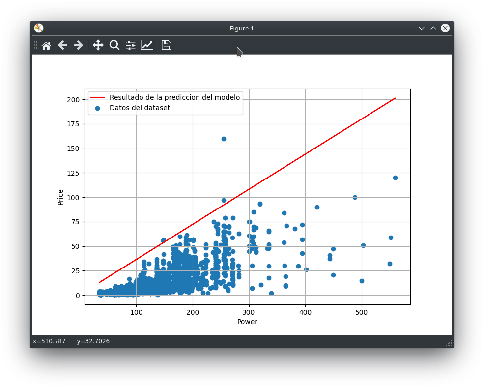
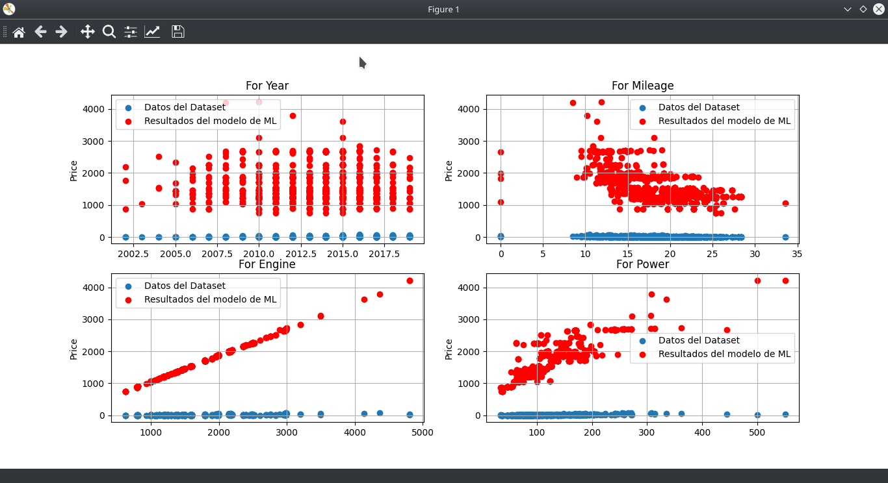
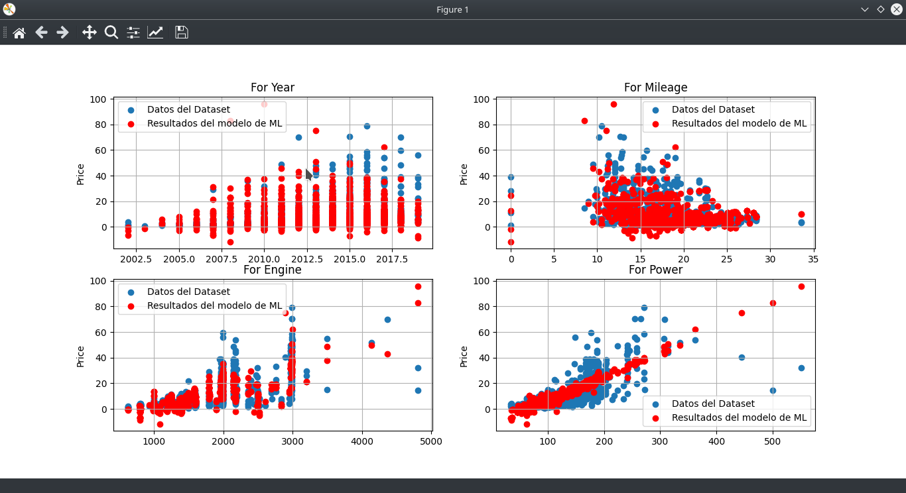

# ML algorithms

Este es un repositorio para los postulates de la **SCESI** (Sociedad Cientifica de Estudiantes de Sistemas e Informatica) en el area de **Inteligencia Artificial (AI)**.

En este repositporio encontrarán algoritmos simples de **Machine Learning (ML)** para que los iniciantes puedan tener una idea de como trabajan estos algoritmos y algoritmos mas complejos como las redes neuronales.

## Requerimientos.

Estos modelos simples de **ML** hacen uso de las siguientes librerias:
- [Numpy](https://numpy.org/)
- [Pandas](https://pandas.pydata.org/)
- [Matplotlib](https://matplotlib.org/)

Antes de instalar las dependencias es recomendable trabajar en un entorno virtual de python con virtualenv o python venv, para esto debe de tener instalado [python3](https://www.python.org/downloads/release/python-377/) en su máquina, debe ser la version de python 3.7 para ser compatible con [Tensorflow](https://www.tensorflow.org/) ya que se usarán esa librería para ejemplos futuros.

Para crear su entorno virtual ejecute:
```
python3 -m venv [directorio]
```
Donde directorio en donde se guardará las librerias que instalaras porteriormente. Por ejemplo:
En Linux:
```
python3 -m venv /home/[user]/enviroments/venv
```
Donde user es el usuario del sistema linux.

Para activar el entorno ejecute:
```
source /home/[user]/enviroments/venv/bin/activate
```
Una vez activada el entorno virtual procedemos a instalar las dependencias, ejecute:
```
pip install -r requirements.txt
```
Listo ya tiene todas las dependencias necesarias para ejecutar los scripts.

## Ejecutando Los scripts

Para ejecutar los scripts ejecute:

El script main.py
```
python main.py
```
Abrira una ventana come esta:


Al cerrarla verá datos que se muestran en consola y mostrará la ventana nuevamente con resultados distintos.

El script multi.py
```
python multi.py
```
Abrira una ventana come esta:
#### Antes del entrenamiento.

#### Despues del entrenamiento.



## Siguentes pasos:

Se implementará estos algoritmos para crear una red neuronal

## Autor

* **Willy Samuel Paz Colque** - *Trabajo total*