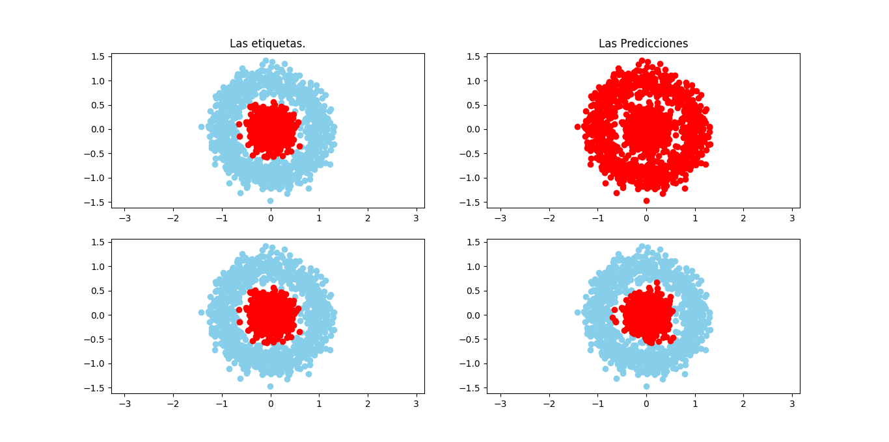

# ML algorithms

Este es un repositorio para los postulates de la **SCESI** (Sociedad Cientifica de Estudiantes de Sistemas e Informatica) en el area de **Inteligencia Artificial (AI)**.

En este repositporio encontrarán algoritmos simples de **Machine Learning (ML)** para que los iniciantes puedan tener una idea de como trabajan estos algoritmos y algoritmos mas complejos como las redes neuronales.

## Requerimientos.

Estos modelos simples de **ML** hacen uso de las siguientes librerias:
- [Numpy](https://numpy.org/)
- [Pandas](https://pandas.pydata.org/)
- [Matplotlib](https://matplotlib.org/)

Antes de instalar las dependencias es recomendable trabajar en un entorno virtual de python con virtualenv o python venv, para esto debe de tener instalado [python3](https://www.python.org/downloads/release/python-377/) en su máquina, debe ser la version de python 3.7 para ser compatible con [Tensorflow](https://www.tensorflow.org/) ya que se usarán esa librería para ejemplos futuros.

Para crear su entorno virtual ejecute:
```
python3 -m venv [directorio]
```
Donde directorio en donde se guardará las librerias que instalaras porteriormente. Por ejemplo:
En Linux:
```
python3 -m venv /home/[user]/enviroments/venv
```
Donde user es el usuario del sistema linux.

Para activar el entorno ejecute:
```
source /home/[user]/enviroments/venv/bin/activate
```
Una vez activada el entorno virtual procedemos a instalar las dependencias, ejecute:
```
pip install -r requirements.txt
```
Listo ya tiene todas las dependencias necesarias para ejecutar los scripts.

## Ejecutando Los scripts

Para ejecutar los scripts ejecute:

El script main.py
```
python main.py
```
Abrira una ventana come esta:


Al cerrarla verá datos que se muestran en consola y mostrará la ventana nuevamente con resultados distintos.

El script multi.py
```
python multi.py
```
Abrira una ventana come esta:
#### Antes del entrenamiento.

#### Despues del entrenamiento.


## Creando una app para calcular el precio de carros.
Un simpre script que hace uso del modelo entrenado en el modulo multi.py
Ejecute:
```
python CarPriceCalculator.py
```
El programa te pedira los siguientes datos para llenar, por ejemplo:
```
Example
Year: 2020
Mileage: 21
Engine: 2333
Power: 123

---> Your car is priced at $ 20637.19197866133
```
## Neural Network, clasificación
Armamos una red neuronal umplementando las capas densas "Dense" heredando parte de la funcionalidad de la Regresion que implementamos antes, simplemente para agregarle una funcion de activación a los resultados de cada capa.

La red neuronal se compone de una lisa de estas capas y  puede dar un resultando ingresando datos y estos datos de propagaran capa por capa hasta dar un resultado, y el resultado.

En el script clasificacion.py se crea este modelo y se entrena para clasificar una nuve de puntos de otras que la rodean como un anillo.

De esta forma:

La primera gráfica de las predicciones se trata los resultados del modelo sin entrenar,
la segunda de los resultados del modelo ya entrenado.

Y en la consola se mostrará un resultado como este:
```
Error is: 0.2543868181634243
Error is: 0.2531264084598974
Error is: 0.25266043676055844
Error is: 0.2520889394488316
Error is: 0.24892151940739865
Error is: 0.2249275503534672
Error is: 0.15697468817907945
Error is: 0.11978657985853354
Error is: 0.11745736267889341
Error is: 0.11661972172063685
Antes de entrenar:
 [[0.8242451 ]
 [0.83103229]
 [0.82731413]
 ...
 [0.8292433 ]
 [0.82540998]
 [0.82827226]]
Despues de entrenar:
 [[0.63807663]
 [0.02063479]
 [0.79308097]
 ...
 [0.03790118]
 [0.78156264]
 [0.60606814]]
```


## Autor

* **Willy Samuel Paz Colque** - *Trabajo total